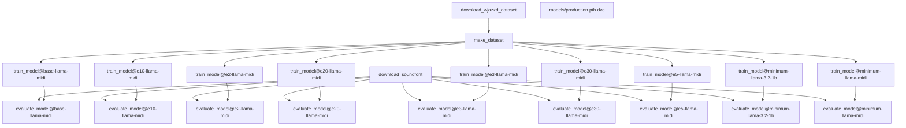

# pipeline

## stages

```mermaid
flowchart TD
	node1["download_soundfont"]
	node2["download_wjazzd_dataset"]
	node3["evaluate_model@base-llama-midi"]
	node4["evaluate_model@e10-llama-midi"]
	node5["evaluate_model@e2-llama-midi"]
	node6["evaluate_model@e20-llama-midi"]
	node7["evaluate_model@e3-llama-midi"]
	node8["evaluate_model@e30-llama-midi"]
	node9["evaluate_model@e5-llama-midi"]
	node10["evaluate_model@minimum-llama-3.2-1b"]
	node11["evaluate_model@minimum-llama-midi"]
	node12["make_dataset"]
	node13["train_model@base-llama-midi"]
	node14["train_model@e10-llama-midi"]
	node15["train_model@e2-llama-midi"]
	node16["train_model@e20-llama-midi"]
	node17["train_model@e3-llama-midi"]
	node18["train_model@e30-llama-midi"]
	node19["train_model@e5-llama-midi"]
	node20["train_model@minimum-llama-3.2-1b"]
	node21["train_model@minimum-llama-midi"]
	node1-->node3
	node1-->node4
	node1-->node5
	node1-->node6
	node1-->node7
	node1-->node8
	node1-->node9
	node1-->node10
	node1-->node11
	node2-->node12
	node12-->node13
	node12-->node14
	node12-->node15
	node12-->node16
	node12-->node17
	node12-->node18
	node12-->node19
	node12-->node20
	node12-->node21
	node13-->node3
	node14-->node4
	node15-->node5
	node16-->node6
	node17-->node7
	node18-->node8
	node19-->node9
	node20-->node10
	node21-->node11
	node22["models/production.pth.dvc"]
```

## files

```mermaid
flowchart TD
	node1["data/interim/flag_evaluate_model-base-llama-midi.txt"]
	node2["data/interim/flag_evaluate_model-e10-llama-midi.txt"]
	node3["data/interim/flag_evaluate_model-e2-llama-midi.txt"]
	node4["data/interim/flag_evaluate_model-e20-llama-midi.txt"]
	node5["data/interim/flag_evaluate_model-e3-llama-midi.txt"]
	node6["data/interim/flag_evaluate_model-e30-llama-midi.txt"]
	node7["data/interim/flag_evaluate_model-e5-llama-midi.txt"]
	node8["data/interim/flag_evaluate_model-minimum-llama-3.2-1b.txt"]
	node9["data/interim/flag_evaluate_model-minimum-llama-midi.txt"]
	node10["data/interim/train.json"]
	node11["data/raw/FluidR3_GM.sf2"]
	node12["data/raw/wjazzd.db"]
	node13["models/base-llama-midi.pth"]
	node14["models/e10-llama-midi.pth"]
	node15["models/e2-llama-midi.pth"]
	node16["models/e20-llama-midi.pth"]
	node17["models/e3-llama-midi.pth"]
	node18["models/e30-llama-midi.pth"]
	node19["models/e5-llama-midi.pth"]
	node20["models/minimum-llama-3.2-1b.pth"]
	node21["models/minimum-llama-midi.pth"]
	node10-->node13
	node10-->node14
	node10-->node15
	node10-->node16
	node10-->node17
	node10-->node18
	node10-->node19
	node10-->node20
	node10-->node21
	node11-->node1
	node11-->node2
	node11-->node3
	node11-->node4
	node11-->node5
	node11-->node6
	node11-->node7
	node11-->node8
	node11-->node9
	node12-->node10
	node13-->node1
	node14-->node2
	node15-->node3
	node16-->node4
	node17-->node5
	node18-->node6
	node19-->node7
	node20-->node8
	node21-->node9
	node22["models/production.pth"]
```
