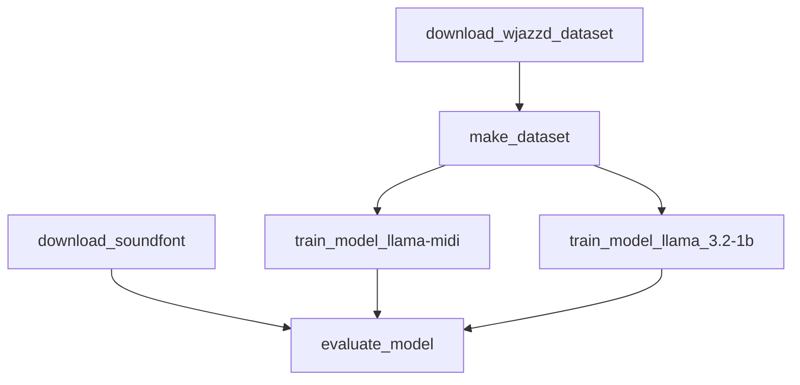
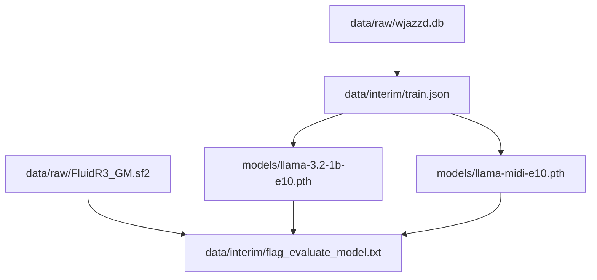

# pipeline

## stages

```mermaid
flowchart TD
	node1["download_soundfont"]
	node2["download_wjazzd_dataset"]
	node3["evaluate_model"]
	node4["make_dataset"]
	node5["train_model_llama-midi"]
	node6["train_model_llama_3.2-1b"]
	node1-->node3
	node2-->node4
	node4-->node5
	node4-->node6
	node5-->node3
	node6-->node3
```

## files

```mermaid
flowchart TD
	node1["data/interim/flag_evaluate_model.txt"]
	node2["data/interim/train.json"]
	node3["data/raw/FluidR3_GM.sf2"]
	node4["data/raw/wjazzd.db"]
	node5["models/llama-3.2-1b-e10.pth"]
	node6["models/llama-midi-e10.pth"]
	node2-->node5
	node2-->node6
	node3-->node1
	node4-->node2
	node5-->node1
	node6-->node1
```
