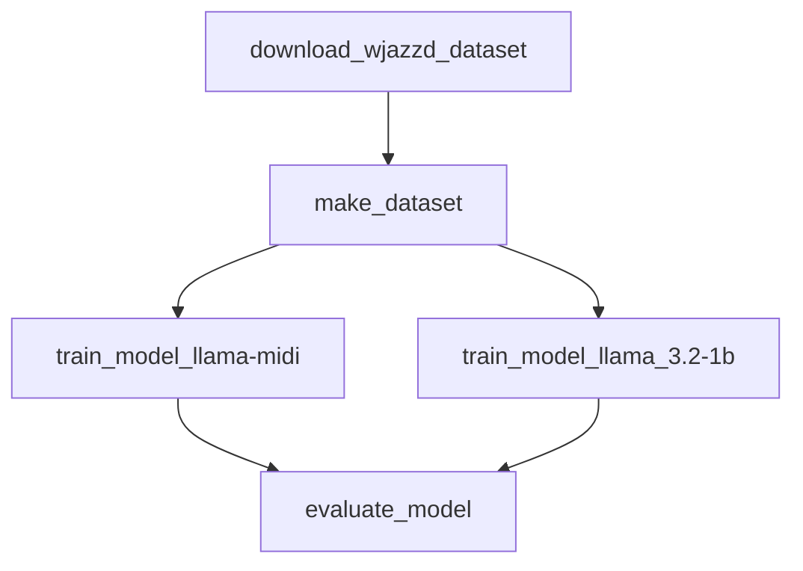
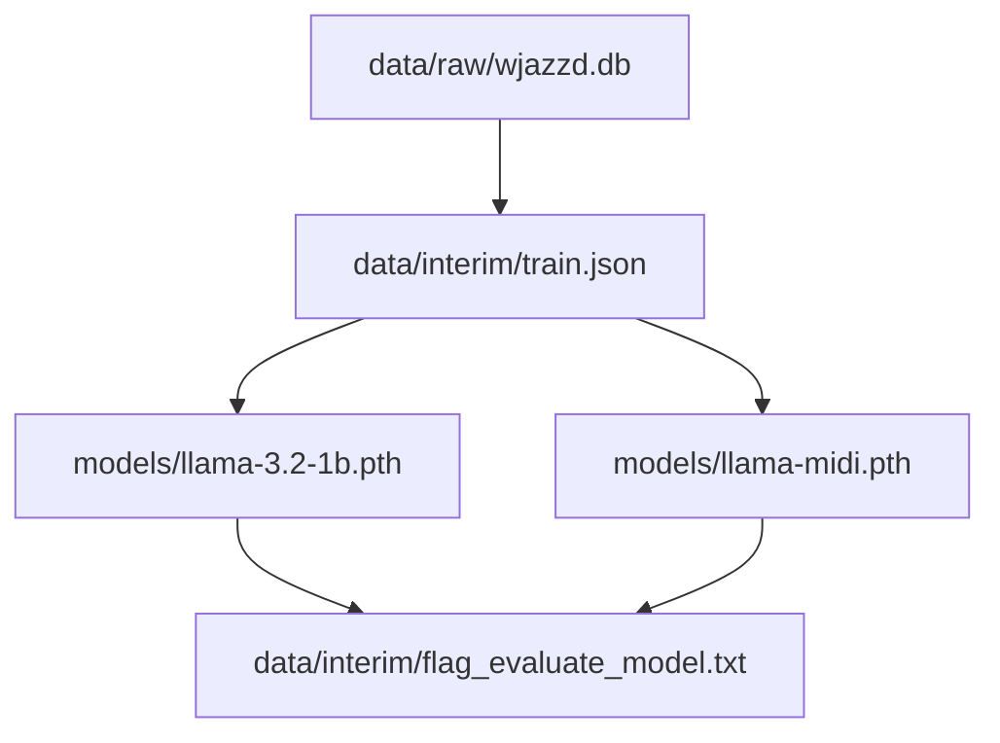

# pipeline

## stages

```mermaid
flowchart TD
	node1["download_wjazzd_dataset"]
	node2["evaluate_model"]
	node3["make_dataset"]
	node4["train_model_llama-midi"]
	node5["train_model_llama_3.2-1b"]
	node1-->node3
	node3-->node4
	node3-->node5
	node4-->node2
	node5-->node2
```

## files

```mermaid
flowchart TD
	node1["data/interim/flag_evaluate_model.txt"]
	node2["data/interim/train.json"]
	node3["data/raw/wjazzd.db"]
	node4["models/llama-3.2-1b.pth"]
	node5["models/llama-midi.pth"]
	node2-->node4
	node2-->node5
	node3-->node2
	node4-->node1
	node5-->node1
```
