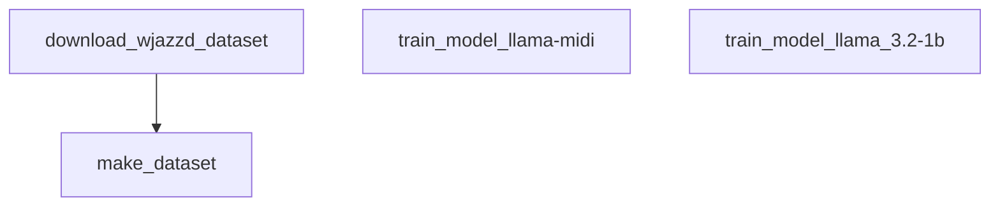
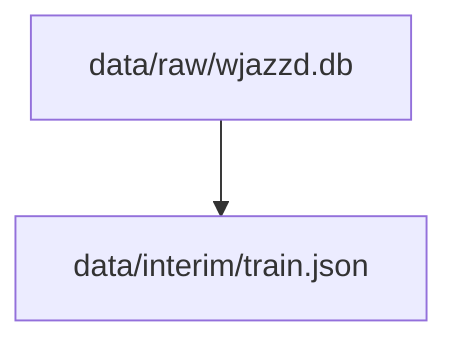

# pipeline

## stages

```mermaid
flowchart TD
	node1["download_wjazzd_dataset"]
	node2["make_dataset"]
	node1-->node2
	node3["train_model_llama-midi"]
	node4["train_model_llama_3.2-1b"]
```

## files

```mermaid
flowchart TD
	node1["data/interim/train.json"]
	node2["data/raw/wjazzd.db"]
	node2-->node1
```
