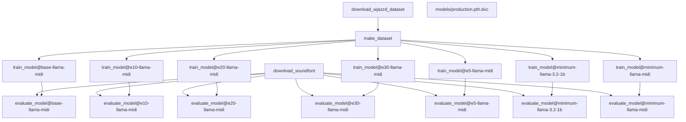
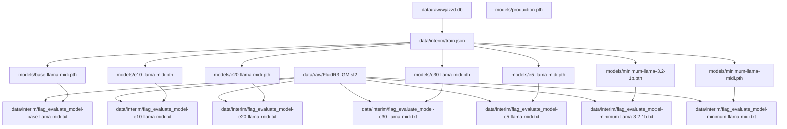

# pipeline

## stages

```mermaid
flowchart TD
	node1["download_soundfont"]
	node2["download_wjazzd_dataset"]
	node3["evaluate_model@base-llama-midi"]
	node4["evaluate_model@e10-llama-midi"]
	node5["evaluate_model@e20-llama-midi"]
	node6["evaluate_model@e30-llama-midi"]
	node7["evaluate_model@e5-llama-midi"]
	node8["evaluate_model@minimum-llama-3.2-1b"]
	node9["evaluate_model@minimum-llama-midi"]
	node10["make_dataset"]
	node11["train_model@base-llama-midi"]
	node12["train_model@e10-llama-midi"]
	node13["train_model@e20-llama-midi"]
	node14["train_model@e30-llama-midi"]
	node15["train_model@e5-llama-midi"]
	node16["train_model@minimum-llama-3.2-1b"]
	node17["train_model@minimum-llama-midi"]
	node1-->node3
	node1-->node4
	node1-->node5
	node1-->node6
	node1-->node7
	node1-->node8
	node1-->node9
	node2-->node10
	node10-->node11
	node10-->node12
	node10-->node13
	node10-->node14
	node10-->node15
	node10-->node16
	node10-->node17
	node11-->node3
	node12-->node4
	node13-->node5
	node14-->node6
	node15-->node7
	node16-->node8
	node17-->node9
	node18["models/production.pth.dvc"]
```

## files

```mermaid
flowchart TD
	node1["data/interim/flag_evaluate_model-base-llama-midi.txt"]
	node2["data/interim/flag_evaluate_model-e10-llama-midi.txt"]
	node3["data/interim/flag_evaluate_model-e20-llama-midi.txt"]
	node4["data/interim/flag_evaluate_model-e30-llama-midi.txt"]
	node5["data/interim/flag_evaluate_model-e5-llama-midi.txt"]
	node6["data/interim/flag_evaluate_model-minimum-llama-3.2-1b.txt"]
	node7["data/interim/flag_evaluate_model-minimum-llama-midi.txt"]
	node8["data/interim/train.json"]
	node9["data/raw/FluidR3_GM.sf2"]
	node10["data/raw/wjazzd.db"]
	node11["models/base-llama-midi.pth"]
	node12["models/e10-llama-midi.pth"]
	node13["models/e20-llama-midi.pth"]
	node14["models/e30-llama-midi.pth"]
	node15["models/e5-llama-midi.pth"]
	node16["models/minimum-llama-3.2-1b.pth"]
	node17["models/minimum-llama-midi.pth"]
	node8-->node11
	node8-->node12
	node8-->node13
	node8-->node14
	node8-->node15
	node8-->node16
	node8-->node17
	node9-->node1
	node9-->node2
	node9-->node3
	node9-->node4
	node9-->node5
	node9-->node6
	node9-->node7
	node10-->node8
	node11-->node1
	node12-->node2
	node13-->node3
	node14-->node4
	node15-->node5
	node16-->node6
	node17-->node7
	node18["models/production.pth"]
```
