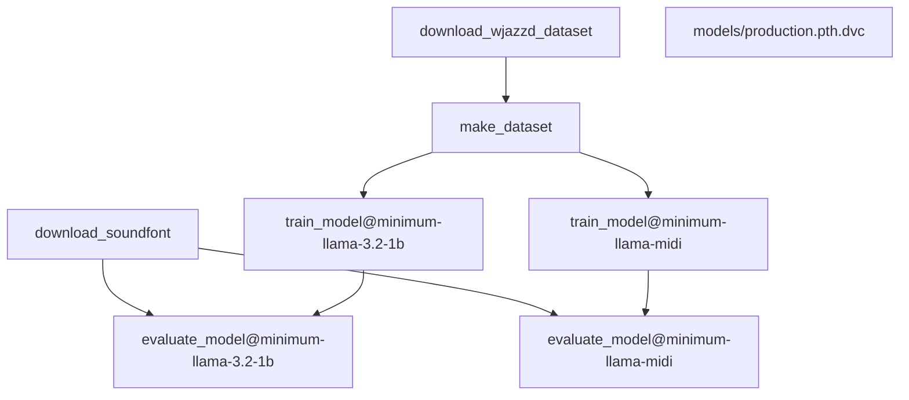
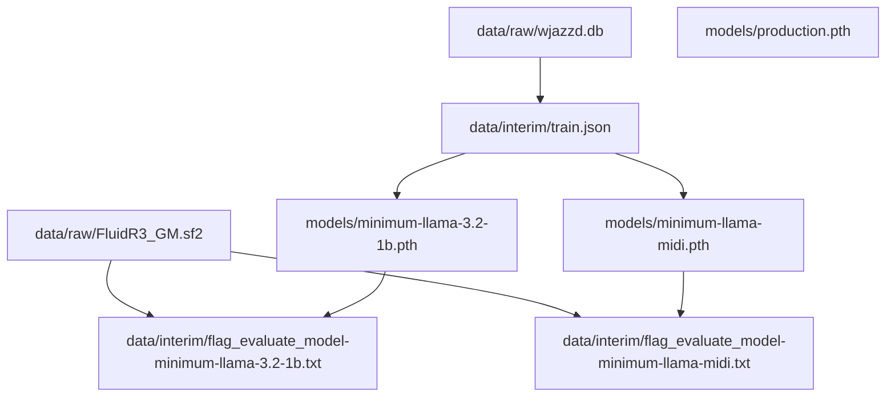

# pipeline

## stages

```mermaid
flowchart TD
	node1["download_soundfont"]
	node2["download_wjazzd_dataset"]
	node3["evaluate_model@minimum-llama-3.2-1b"]
	node4["evaluate_model@minimum-llama-midi"]
	node5["make_dataset"]
	node6["train_model@minimum-llama-3.2-1b"]
	node7["train_model@minimum-llama-midi"]
	node1-->node3
	node1-->node4
	node2-->node5
	node5-->node6
	node5-->node7
	node6-->node3
	node7-->node4
	node8["models/production.pth.dvc"]
```

## files

```mermaid
flowchart TD
	node1["data/interim/flag_evaluate_model-minimum-llama-3.2-1b.txt"]
	node2["data/interim/flag_evaluate_model-minimum-llama-midi.txt"]
	node3["data/interim/train.json"]
	node4["data/raw/FluidR3_GM.sf2"]
	node5["data/raw/wjazzd.db"]
	node6["models/minimum-llama-3.2-1b.pth"]
	node7["models/minimum-llama-midi.pth"]
	node3-->node6
	node3-->node7
	node4-->node1
	node4-->node2
	node5-->node3
	node6-->node1
	node7-->node2
	node8["models/production.pth"]
```
