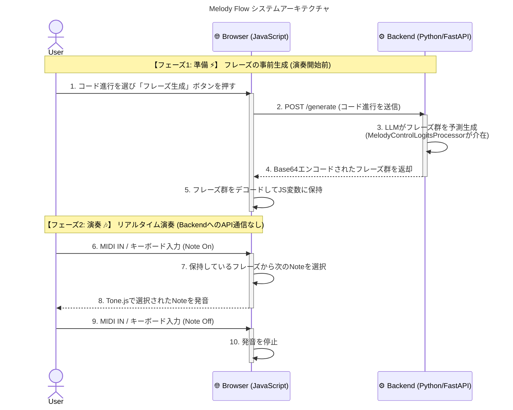

# Melody Flow 🎹✨

**キャッチコピー: あなたのリズムが、AIのメロディになる。**

---

## 🎵 Melody Flowとは？

Melody Flowは、**人間とAIがリアルタイムでセッションを行う、新しい音楽共創ツール**です。

「楽器を演奏してみたいけど、音楽理論は難しそう…」
「作曲に挑戦したいけど、何から始めればいいか分からない…」

そんな悩みを持つあなたのために生まれました。
ユーザーは「リズム」と「演奏のニュアンス（強弱など）」を直感的に入力するだけ。AIがその瞬間のコード進行に合わせて、最適な「メロディ（音の高さ）」を自動で奏でてくれます。

音楽の知識がなくても、まるでプロのミュージシャンになったかのように、アドリブ演奏や作曲の楽しさを体験できます。

## 🌟 主な特徴

### 1. 音楽理論からの解放
メロディはすべてAIが考えてくれるので、難しい音楽理論を覚える必要はありません。あなたはただ、心の赴くままにリズムを刻むだけ。音楽の楽しさに集中できます。

### 2. 「自分が演奏している」という確かな感覚
AIが生成したメロディは、あなたがキーボードを叩いたタイミング、強さ、長さで完璧に再生されます。AIが作った音楽をただ聴くだけでなく、「自分の手で音楽を奏でている」という確かな実感を得られます。

### 3. AIとのセッションが生み出す、予測不能な興奮
あなたが刻むリズムと、AIが提案するメロディ。二つが組み合わさることで、一人では決して生まれなかったような、創造的で刺激的なフレーズが生まれます。AIとの音楽対話を楽しみましょう。

## 🎶 仕組み：あなたとAIの役割分担

Melody Flowの核は、音楽の要素をあなたとAIで分担することです。

-   **ハーモニー（コード進行）**: システムが自動で伴奏を再生します。
-   **メロディ（ドレミ）**: **AI 🤖** が担当します。
-   **リズムと表現（タイミングや強弱）**: **あなた 👤** が担当します。

あなたは音階を気にする必要はありません。目の前のキーボードを打楽器のように叩くだけで、音楽が生まれます。

より詳細な処理の流れは以下の通りです。演奏中の遅延をなくすため、AIによる重い処理は演奏開始前に済ませておく「事前生成方式」を採用しているのが特徴です。

## 🚀 はじめ方

Webアプリケーションで、すぐに体験できます。

1.  **設定**: Web画面で好きな「コード進行」と「音楽スタイル（JAZZ風など）」を選びます。
2.  **伴奏スタート**: 再生ボタンを押すと、AIによる伴奏が始まります。
3.  **リズム入力**: MIDIキーボードやPCのキーボード（スペースキーなど）で、伴奏に合わせて自由にリズムを叩いてみましょう！

あなたが叩いたリズムで、美しいメロディがリアルタイムに響き渡ります。

## 🔧 使用技術について

この魔法のような体験は、最先端のAI技術とWeb技術によって実現されています。

-   **バックエンド (AI)**: Python, FastAPI, PyTorch, Transformers
-   **フロントエンド (Web)**: JavaScript, Tone.js, WebMidi.js
-   **AIモデル**: `dx2102/llama-midi` をベースに、高品質なジャズの演奏データでファインチューニングしたカスタムモデルを使用しています。

**技術的なこだわり**:
AIが生成するメロディが音楽的に破綻しないよう、独自の制御システム（Logits Processor）を開発しました。これにより、AIの創造性と音楽理論の正確さを両立させ、高品質な音楽体験を実現しています。

## ⚖️ ライセンスと帰属 (License and Attribution)

このプロジェクトは、複数のオープンソースのモデルおよびデータセットを利用しています。各コンポーネントのライセンス情報は以下の通りです。

### ⚠️ 商用利用に関する重要な注意

このプロジェクトで使用されているモデルの一つ `dx2102/llama-midi` は、**非商用 (Non-Commercial)** のデータセット (`projectlosangeles/Los-Angeles-MIDI-Dataset`) を用いて学習されています。

そのため、`dx2102/llama-midi` モデル、およびそれを組み込んだこの `Melody Flow` プロジェクト全体は、**現状では商用利用ができません**。ご注意ください。

商用利用を検討される場合は、`dx2102/llama-midi` を、商用利用が明確に許可されているデータセットのみでファインチューニングしたモデルに置き換える必要があります。

### モデル

1.  **`dx2102/llama-midi`**
    -   **ライセンス**: Llama 3.2 Community License
    -   **商用利用**: **不可** (非商用データセットで学習されているため)
    -   **ベースモデル**: `meta-llama/Llama-3.2-1B-Instruct`
    -   **学習データ**: `amaai-lab/MidiCaps`, `projectlosangeles/Los-Angeles-MIDI-Dataset`

2.  **`unsloth/Llama-3.2-1B-bnb-4bit` (およびそのファインチューニング後モデル)**
    -   **ライセンス**: Llama 3.2 Community License
    -   **商用利用**: **可** (ただし、サービスの月間アクティブユーザーが7億人を超える場合はMeta社へのライセンス申請が必要)
    -   **ファインチューニングデータ**: `wjazzd.db`

### データセット

1.  **Weimar Jazz Database (`wjazzd.db`)**
    -   **ライセンス**: [Open Data Commons Open Database License (ODbL)](https://opendatacommons.org/licenses/odbl/1-0/)
    -   **商用利用**: **可** (ただし、帰属表示と、派生データベースを同じライセンスで共有することが条件)
    -   **帰属**: The Jazzomat Research Project (Hochschule für Musik FRANZ LISZT Weimar)

2.  **MidiCaps (`amaai-lab/MidiCaps`)**
    -   **ライセンス**: [Creative Commons Attribution-ShareAlike 4.0 International (CC BY-SA 4.0)](https://creativecommons.org/licenses/by-sa/4.0/)
    -   **商用利用**: **可** (ただし、帰属表示と、派生作品を同じライセンスで共有することが条件)
    -   **帰属**: Jan Melechovsky, Abhinaba Roy, Dorien Herremans. 2024. MidiCaps: A large-scale MIDI dataset with text captions.
    -   *注: このデータセットは、CC-BY 4.0ライセンスの Lakh MIDI Dataset を元に作成されています。*

3.  **Los-Angeles-MIDI-Dataset (`projectlosangeles/Los-Angeles-MIDI-Dataset`)**
    -   **ライセンス**: [Creative Commons Attribution-**NonCommercial**-ShareAlike 4.0 International (CC BY-NC-SA 4.0)](https://creativecommons.org/licenses/by-nc-sa/4.0/)
    -   **商用利用**: **不可**

## 🌱 今後の開発

-   演奏したメロディをMIDIファイルとして書き出す機能
-   ユーザーが自由にコード進行を作成できる機能
-   対応音楽スタイルの追加（クラシック、Lo-fi Hip Hopなど）

---

Melody Flowが、あなたの日常に新しい創造性とインスピレーションをもたらすことを願っています。
