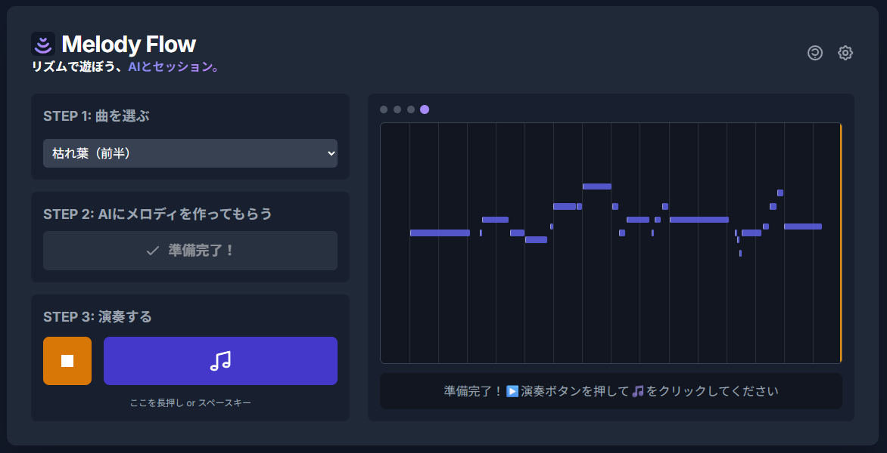

# Melody Flow 🎹✨

**リズムで遊ぼう、AIとセッション。**

-----

## 🎵 Melody Flowとは？

Melody Flowは、**人間とAIがリアルタイムでセッションを行う、新しい音楽共創ツール**です。

「楽器を演奏してみたいけど、音楽理論は難しそう…」
「作曲に挑戦したいけど、何から始めればいいか分からない…」

そんな悩みを持つあなたのために生まれました。
ユーザーは「リズム」と「演奏のニュアンス（強弱など）」を直感的に入力するだけ。AIがその瞬間のコード進行に合わせて、最適な「メロディ（音の高さ）」を自動で奏でてくれます。

音楽の知識がなくても、まるでプロのミュージシャンになったかのように、アドリブ演奏や作曲の楽しさを体験できます。

-----

## 🌟 主な特徴

### 1. 音楽理論からの解放

メロディはすべてAIが考えてくれるので、難しい音楽理論を覚える必要はありません。あなたはただ、心の赴くままにリズムを刻むだけ。音楽の楽しさに集中できます。

### 2. 「自分が演奏している」という確かな感覚

AIが生成したメロディは、あなたがキーボードを叩いたタイミング、強さ、長さで完璧に再生されます。AIが作った音楽をただ聴くだけでなく、「自分の手で音楽を奏でている」という確かな実感を得られます。

### 3. AIとのセッションが生み出す、予測不能な興奮

あなたが刻むリズムと、AIが提案するメロディ。二つが組み合わさることで、一人では決して生まれなかったような、創造的で刺激的なフレーズが生まれます。AIとの音楽対話を楽しみましょう。

-----

## 🚀 はじめ方

Webアプリケーションで、すぐに体験できます。

**[https://melody-flow.click](https://melody-flow.click)**

1.  **設定**: 曲を選びます
2.  **AI生成**: AI にメロディを作ってもらいます(キャッシュされてるので一瞬でできる)
3.  **演奏スタート**: 再生ボタンで伴奏が始まったら、🎵ボタンやスペースバーで、伴奏に合わせて自由にリズムを叩いてみましょう！

あなたが叩いたリズムで、美しいメロディがリアルタイムに響き渡ります。

Google Chrome を使えば MIDI IN デバイスにも対応します！

-----

## ✨ 2つのUIモード

Melody Flowは、目的に合わせて2つのUIモードを切り替えられます。

| Play Mode (シンプル)                                         | Studio Mode (詳細)                                           |
| :----------------------------------------------------------- | :----------------------------------------------------------- |
| まずは気軽にセッションを楽しみたい方向けのシンプルな画面です。 | BPMやキーの変更など、より詳細な設定が可能な画面です。        |
|  |  |

-----

## 🧠 技術的な仕組み (Technical Deep Dive)

Melody Flowの魔法のような体験は、リアルタイム性を追求したアーキテクチャと、音楽に特化したカスタムAIモデルによって実現されています。

### 1. システムアーキテクチャ：遅延なき演奏体験

演奏体験におけるリアルタイム性を確保するため、処理を**「準備」**と**「演奏」**の2フェーズに分離しています。AIによる重い処理はすべて演奏開始前に済ませておくことで、楽器のような即時応答性を実現しました。


さらに、本番環境では事前生成した全フレーズを静的なJSONファイルとしてCDNから配信する**「静的配信アーキテクチャ」**を採用。これにより、AIの推論時間を待つことなく、常に最高のレスポンス速度とスケーラビリティを実現しています。

### 2. AIモデル：汎用モデルからジャズの専門家へ

Melody Flowの心臓部であるAIモデルは、汎用的な言語モデルに高品質なジャズ演奏データを追加学習（ファインチューニング）させた、独自のカスタムモデルです。


### 3. 秘密兵器：`MelodyControlLogitsProcessor`

AIの創造性を活かしつつ、音楽的に破綻しないメロディを生成するための「秘密兵器」が、この独自の制御システムです。LLMが次の音を決定する直前の思考プロセスに介入し、音楽理論に基づいた「ガードレール」を設ける役割を果たします。


-----

## 🛠️ ローカルでの実行方法 (Installation)

以下の手順で、あなたのローカルマシンにMelody Flowの環境を構築し、事前に学習されたモデルを使ってアプリケーションを実行できます。

  - **GPU**: VRAM 8GB 程度
  - **RAM**: 8GB 程度

<!-- end list -->

1.  **Pythonのインストール**:
    Python 3.12 以上がインストールされていることを確認してください。

2.  **uvのインストール**:
    このプロジェクトは `uv` を使ってパッケージを管理しています。

    ```bash
    pip install uv
    ```

3.  **リポジトリのクローン**:

    ```bash
    git clone https://github.com/u-masao/melody-flow.git
    cd melody-flow
    ```

4.  **依存パッケージのインストール**:

    ```bash
    uv sync
    ```

5.  **アプリケーションの起動**:

    ```bash
    make dev-server
    ```

    サーバーが `http://localhost:8000` で起動します。Webブラウザでこのアドレスにアクセスすると、Melody FlowのUIが表示されます。

-----

## 🎓 モデルの再学習 (Model Retraining)

提供されているデータセット (`wjazzd.db`) を使ってモデルを再学習（ファインチューニング）する場合は、以下のコマンドを実行します。

```bash
make repro
```

このコマンドは [DVC](https://dvc.org/) パイプラインを実行し、データセットのダウンロード、前処理、モデルの学習を自動的に行います。

**注意**: モデルの学習には、相応のスペックを持つGPUと時間が必要です。私の環境では NVIDIA GeForce RTX4060Ti 16GB で 6 時間程度でした。

-----

## 🔧 使用技術

  - **バックエンド (AI)**: Python, FastAPI, PyTorch, Transformers, Unsloth
  - **フロントエンド (Web)**: JavaScript, Tone.js, WebMidi.js, Tailwind CSS
  - **AIモデル**: `dx2102/llama-midi` をベースに、高品質なジャズの演奏データでファインチューニングしたカスタムモデルを使用しています。

-----

## ⚖️ ライセンスと帰属 (License and Attribution)

このプロジェクトは、複数のオープンソースのモデルおよびデータセットを利用しています。各コンポーネントのライセンス情報は以下の通りです。

### ⚠️ 商用利用に関する重要な注意

このプロジェクトで使用されているモデルの一つ `dx2102/llama-midi` は、**非商用 (Non-Commercial)** のデータセット (`projectlosangeles/Los-Angeles-MIDI-Dataset`) を用いて学習されています。

そのため、`dx2102/llama-midi` モデル、およびそれを組み込んだこの `Melody Flow` プロジェクト全体は、**現状では商用利用ができません**。ご注意ください。

### モデル

1.  **`dx2102/llama-midi`**

      - **ライセンス**: Llama 3.2 Community License
      - **商用利用**: **不可** (非商用データセットで学習されているため)
      - **ベースモデル**: `meta-llama/Llama-3.2-1B-Instruct`
      - **学習データ**: `amaai-lab/MidiCaps`, `projectlosangeles/Los-Angeles-MIDI-Dataset`

2.  **`unsloth/Llama-3.2-1B-bnb-4bit` (およびそのファインチューニング後モデル)**

      - **ライセンス**: Llama 3.2 Community License
      - **商用利用**: **可** (ただし、サービスの月間アクティブユーザーが7億人を超える場合はMeta社へのライセンス申請が必要)
      - **ファインチューニングデータ**: `wjazzd.db`

### データセット

1.  **Weimar Jazz Database (`wjazzd.db`)**

      - **ライセンス**: [Open Data Commons Open Database License (ODbL)](https://opendatacommons.org/licenses/odbl/1-0/)
      - **商用利用**: **可** (帰属表示と派生データベースの同ライセンス共有が条件)
      - **帰属**: The Jazzomat Research Project (Hochschule für Musik FRANZ LISZT Weimar)

2.  **MidiCaps (`amaai-lab/MidiCaps`)**

      - **ライセンス**: [Creative Commons Attribution-ShareAlike 4.0 International (CC BY-SA 4.0)](https://creativecommons.org/licenses/by-sa/4.0/)
      - **商用利用**: **可** (帰属表示と派生作品の同ライセンス共有が条件)

3.  **Los-Angeles-MIDI-Dataset (`projectlosangeles/Los-Angeles-MIDI-Dataset`)**

      - **ライセンス**: [Creative Commons Attribution-**NonCommercial**-ShareAlike 4.0 International (CC BY-NC-SA 4.0)](https://creativecommons.org/licenses/by-nc-sa/4.0/)
      - **商用利用**: **不可**

-----

## 🌱 今後の開発

  - 演奏したメロディをMIDIファイルとして書き出す機能
  - ユーザーが自由にコード進行を作成できる機能
  - 対応音楽スタイルの追加（クラシック、Lo-fi Hip Hopなど）
