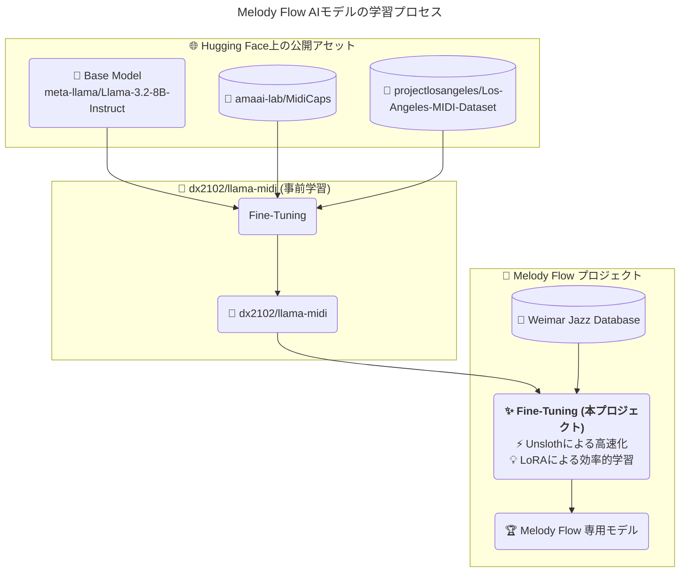
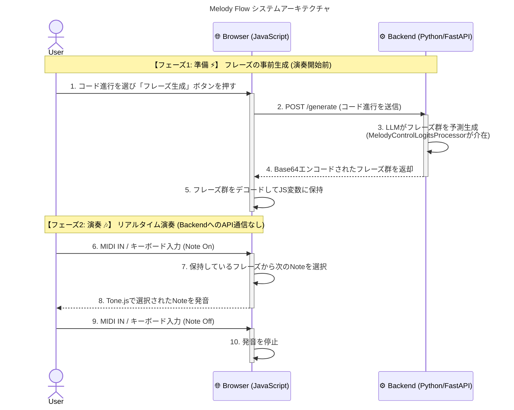
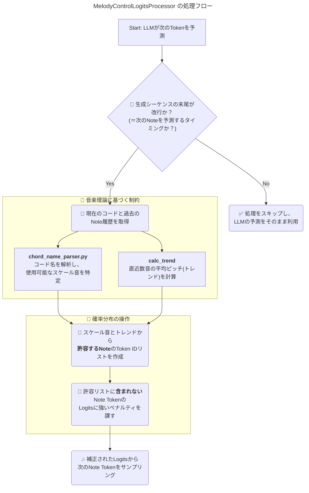

# 🎹 Melody Flow アーキテクチャ 🚀

Melody Flow の技術的な全体像と、AIが音楽を生成する仕組みを解説します。

---

## 1. 🧠 AIモデルの系統とファインチューニングのプロセス

Melody Flowの心臓部であるAIモデルは、汎用的な大規模言語モデルから、音楽、特にジャズの演奏に特化したモデルへと段階的に進化させています。この図は、その進化の道のりを示しています。

- **起源 (Base Model)**: 全ての始まりは、Meta社が開発した高性能な `Llama-3.2-8B-Instruct` です。これはテキスト生成の汎用モデルです。
- **第一次ファインチューニング**: このベースモデルに、`MidiCaps` と `Los-Angeles-MIDI-Dataset` という2つの巨大なMIDIデータセットを追加学習させ、音楽の構造やシーケンスを理解する能力を獲得した `dx2102/llama-midi` モデルが誕生しました。
- **第二次ファインチューニング (本プロジェクト)**: 我々はこの `llama-midi` をさらに専門的にするため、「ワイマール・ジャズ・データベース (`Weimar Jazz Database`)」という高品質なジャズソロのデータセットで追加学習を行いました。この際、**Unsloth** ライブラリによる高速化と **LoRA** というメモリ効率の良い学習手法を組み合わせることで、限られたリソースでも効率的に専門性の高いモデルを開発することに成功しました。

このプロセスを経て、最終的にジャズ特有の「うねり」や「語彙」を理解し、創造的なメロディを生成できる **🏆 Melody Flow 専用モデル** が完成しました。

## 2. ⚙️ システム全体のアーキテクチャ (シーケンス図)

ユーザーの演奏体験におけるリアルタイム性を確保することが、このシステムの最も重要な設計思想です。AIの思考時間（推論レイテンシ）が演奏の妨げにならないよう、処理を以下の2つのフェーズに明確に分離しています。

  - フェーズ1: 準備段階 (フレーズの事前生成)
    - ユーザーが演奏を開始する前に、指定されたコード進行の各コードに対して、AIがメロディフレーズをあらかじめ全て生成しておきます。
    - この重い処理を先に行うことで、演奏中のバックエンドへの通信を不要にします。
  - フェーズ2: リアルタイム演奏
    - 演奏中は、すべての処理がユーザーのブラウザ内で完結します。
    - MIDIやキーボードからの入力は、JavaScriptによって即座に検知され、準備段階で生成・保持しておいたフレーズの中から次の音が選択されて発音されます。
    - これにより、API通信の遅延を完全に排除し、楽器のような即時応答性を実現しています。

## 3. 🎛️ MelodyControlLogitsProcessor の内部処理フロー

AIが単なるランダムな音の羅列ではなく、音楽的に意味のあるメロディを生成するための「秘密兵器」がこの MelodyControlLogitsProcessor です。これは、LLMが次の音を決定する直前の思考プロセスに介入し、音楽理論に基づいた「ガードレール」を設ける役割を果たします。

    - Logitsとは？: LLMが次にどの単語（この場合はどのMIDIノート番号）を生成するかの「確率の元になるスコア」です。このスコアが高いほど、その音が選ばれる可能性が高くなります。
    - 処理の流れ:
        - LLMがメロディの次の音を予測するタイミングになると、このプロセッサが起動します。
        - コード解析: 現在のコード進行（例: "Dm7"）を音楽理論的に解析し、そのコードに最も響きが良いとされるスケール音のリストアップします（chord_name_parser.py）。
        - トレンド計算: 直前に生成された数音の流れを分析し、メロディが急激に跳躍しすぎないよう、次に出現すべき音域（トレンド）を計算します。
        - 確率操作: 上記の2つの情報（スケールとトレンド）を基に、「許容する音」のリストを作成します。そして、そのリストに含まれない音のLogits（スコア）に意図的にペナルティを与え、出現確率を劇的に下げます。
        - 最終決定: このようにして音楽的にフィルタリングされた確率分布の中から、最終的な次の音がサンプリングされます。

これにより、AIの創造性を活かしつつも、コードから逸脱しない、自然で心地よいメロディラインの生成を実現しています。

