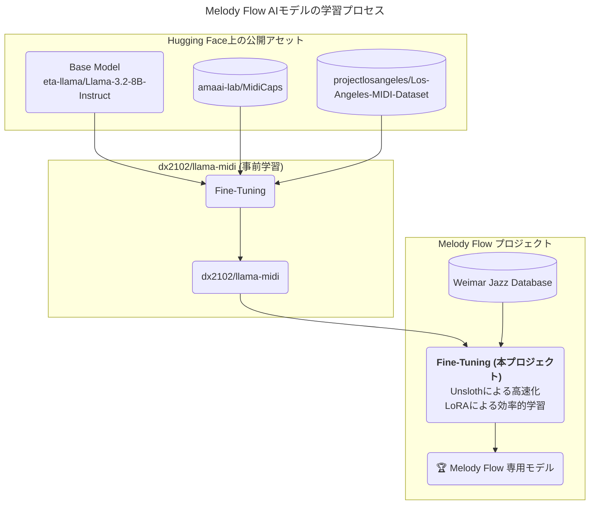
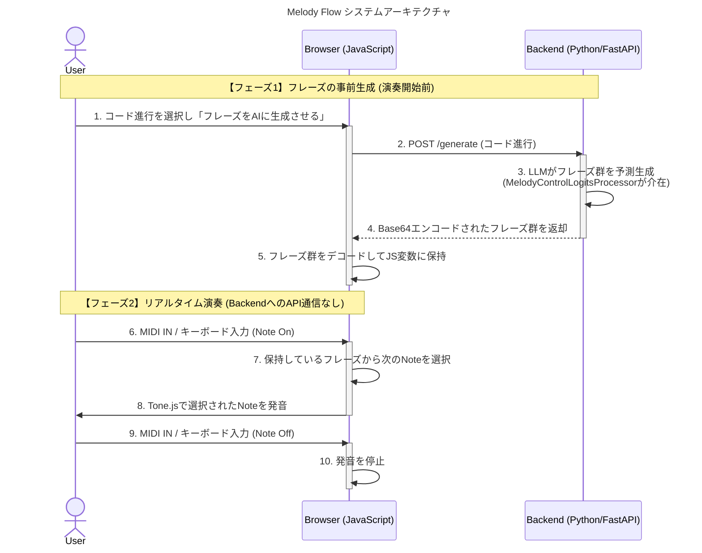
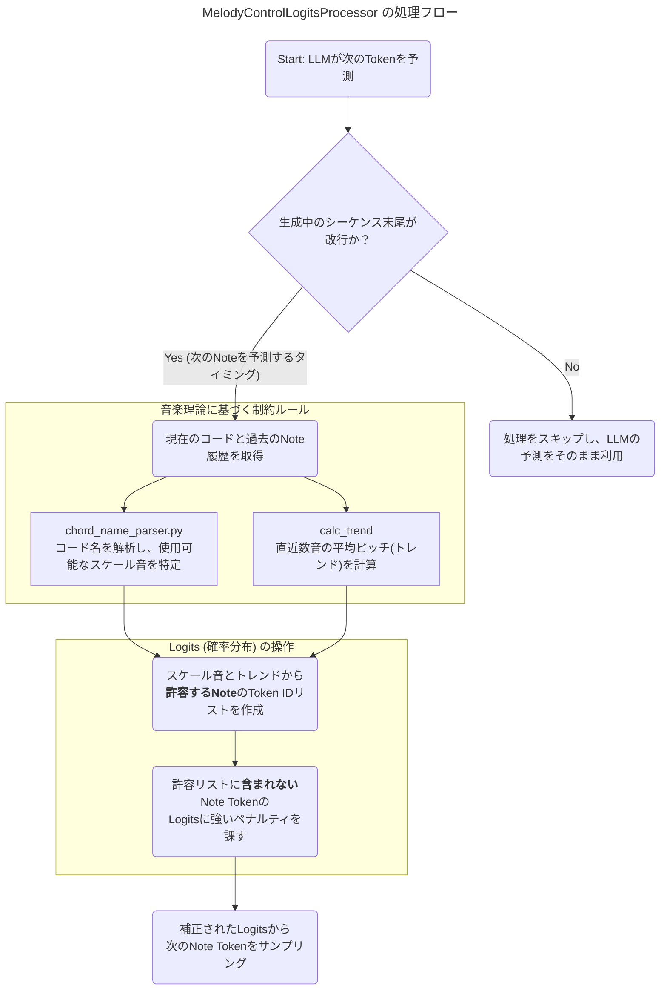

# アーキテクチャ

Melody Flow のアーキテクチャ

## 1. AIモデルの系統とファインチューニングのプロセス

dx2102/llama-midiがどのように作られ、このプロジェクトでさらにどう進化したかを図示します。

## 2. システム全体のアーキテクチャ (シーケンス図)

ユーザーのMIDI入力が、どのようにブラウザとバックエンドの間で処理されるかを図示します。演奏中のリアルタイム性を担保するために、AIによるフレーズ生成を事前に行う点がアーキテクチャの重要なポイントです。

## 3. MelodyControlLogitsProcessor の内部処理フロー

バックエンドでAIが次の音を予測する瞬間に、どのように音楽理論に基づいた制約をかけているかを図示します。

