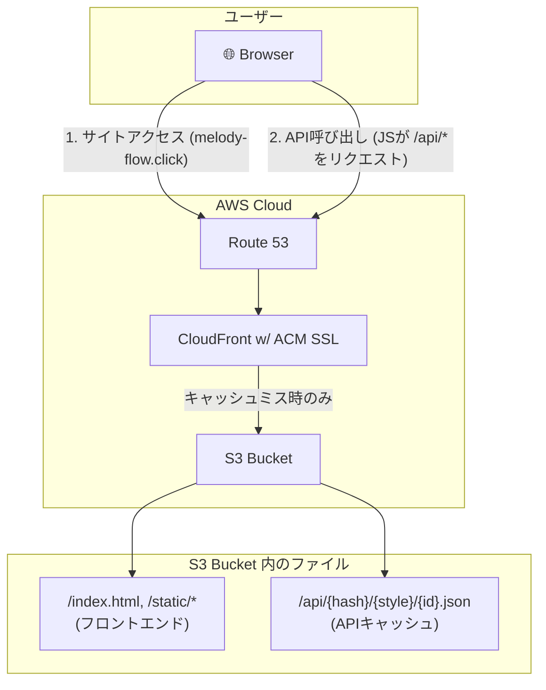

# **Melody Flow 静的デプロイガイド (AWS S3 + CloudFront)**

## **1. 背景と目的**

### **背景**

初期のMelody Flowは、AI推論のためにGPU搭載のEC2サーバーを必要とする動的なアーキテクチャでした。しかし、ユーザー体験の向上、コストの最適化、そして運用負荷の劇的な削減を目指し、アーキテクチャを全面的に見直しました。

その結果、**サーバーサイドの処理を完全に排除**し、事前にAIが生成したすべてのメロディフレーズを静的なJSONファイルとして配信する\*\*「完全静的アーキテクチャ」\*\*へと進化しました。

### **目的**

本ガイドは、この新しいMelody Flowアプリケーション全体をAWS上にデプロイするための手順を提供します。目標は、以下の要件を満たす、モダンで堅牢な本番環境を構築することです。

  * **究極のパフォーマンス:** 全てのコンテンツをCDNのエッジから配信し、世界中のどこからでも最速の応答速度を実現する。
  * **鉄壁のセキュリティ:** すべての通信をSSL/TLSで暗号化し、サーバーサイドの脆弱性をゼロにする。
  * **抜本的なコスト削減:** EC2などの常時稼働サーバーを完全に排除し、インフラコストをS3とCloudFrontの利用料のみに最小化する。
  * **運用のシンプル化:** サーバーの監視、パッチ適用、コンテナ管理といった複雑な運用業務を一切不要にする。

## **2. 構成概要**

このデプロイ構成は、静的サイト配信のベストプラクティスである「**S3 + CloudFront**」を最大限に活用したものです。フロントエンドのWebサイトと、APIとして機能するJSONファイルの両方を、単一のS3バケットとCloudFrontディストリビューションで配信します。

### **全体構成図**



### **コンポーネント詳細**

| コンポーネント | 役割 |
| :--- | :--- |
| **Route 53** | `melody-flow.click` の名前解決を担当するDNSサービス。 |
| **S3** | フロントエンドの静的ファイル (`index.html`, `js`等) と、API応答となる全てのJSONファイルを保管するオブジェクトストレージ。 |
| **ACM** | `melody-flow.click` 用の無料SSL証明書を発行・管理。 |
| **CloudFront** | S3のコンテンツを世界中にキャッシュ配信するCDN。ACMの証明書を使ってHTTPS化も担う。実質的なWebサーバーとして機能する。 |

## **3. デプロイ手順**

### **3.1. 事前準備**

1.  **AWSアカウント** を準備する。
2.  **Route 53** でドメイン `melody-flow.click` のホストゾーンを作成済みであること。
3.  ローカルマシンにプロジェクトのソースコード一式が準備できており、モデルのダウンロードと依存パッケージのインストールが完了していること (`make repro` と `uv sync` を実行済み)。

### **3.2. (ローカルで実行) 静的コンテンツの生成**

デプロイの最初のステップとして、AIモデルを使ってAPIの応答となる全てのJSONファイルをローカルマシンで生成します。

1.  **静的キャッシュ生成コマンドの実行:**
    プロジェクトのルートディレクトリで、以下のコマンドを実行します。これにより、`src/warmup/generate_static_cache.py` スクリプトが起動します。
    ```bash
    make static_cache
    ```
2.  **`dist/` ディレクトリの確認:**
    コマンドが完了すると、プロジェクトルートに `dist/` ディレクトリが作成されます。この中には、ハッシュ化されたコード進行ごとのディレクトリが格納されており、その先にAPI応答となる `.json` ファイルが配置されています。これがAPIサーバーの代わりとなります。

### **3.3. コンテンツのデプロイ (S3 + CloudFront)**

次に、生成した静的コンテンツをAWSにアップロードし、公開します。

1.  **S3バケットの作成:**

      * バケット名を `melody-flow.click` として作成。
      * 「静的ウェブサイトホスティング」を有効化する。
      * パブリックアクセスを許可するバケットポリシーを設定する。

2.  **ファイルのアップロード:**

      * `static/` ディレクトリ内の全ファイルをS3バケットの**ルート**にアップロードする。
      * ローカルで生成した `dist/` ディレクトリの中身を、S3バケット内に新しく作成した **`api/`** フォルダにアップロードする。（例: `dist/{hash}/...` が `s3://melody-flow.click/api/{hash}/...` となるように配置）

3.  **SSL証明書のリクエスト (ACM):**

      * **リージョンを「米国東部 (バージニア北部) us-east-1」に変更**する。
      * AWS Certificate Manager (ACM) で `melody-flow.click` のパブリック証明書をリクエストし、DNS検証で発行する。

4.  **CloudFrontディストリビューションの作成:**

      * オリジンに作成したS3バケットを指定する。
      * **ビューワープロトコルポリシー:** `Redirect HTTP to HTTPS` を選択。
      * **代替ドメイン名 (CNAMEs):** `melody-flow.click` を設定。
      * **カスタムSSL証明書:** ステップ3で発行した証明書を選択。
      * **デフォルトルートオブジェクト:** `index.html` を設定。

5.  **DNS設定 (Route 53):**

      * `melody-flow.click` のホストゾーンで、`melody-flow.click` の **Aレコード** を作成する。
      * エイリアスを有効にし、ターゲットとしてステップ4で作成したCloudFrontディストリビューションを選択する。

### **3.4. 動作確認**

1.  ブラウザで `https://melody-flow.click` にアクセスし、フロントエンドが正しく表示されることを確認する。
2.  開発者ツールを開き、アプリケーションを操作（「メロディを作る」ボタンを押す）する。
3.  ネットワークタブで `https://melody-flow.click/api/...` という形式のURLに対してリクエストが飛び、ステータスコード `200` でJSONファイルが正常に取得できていることを確認する。
4.  AIとのセッションが正常に動作することを確認する。
